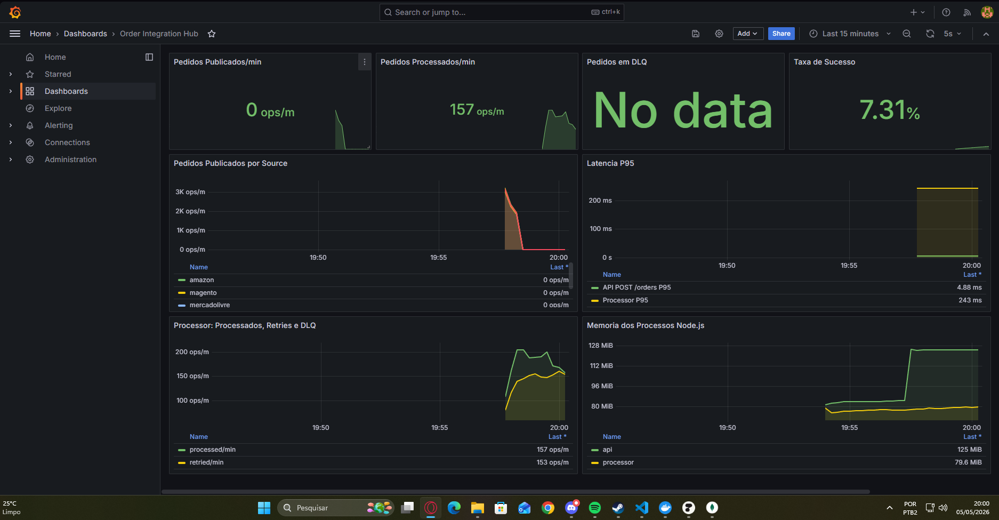
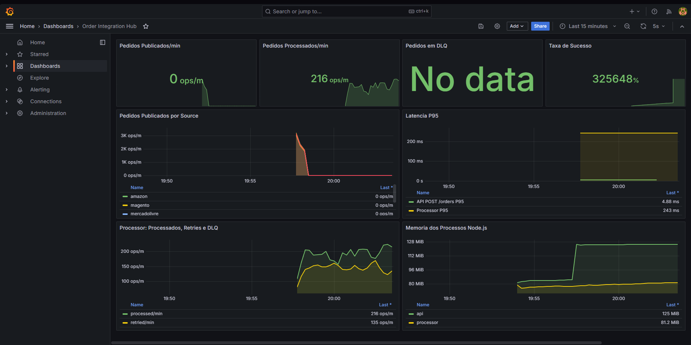
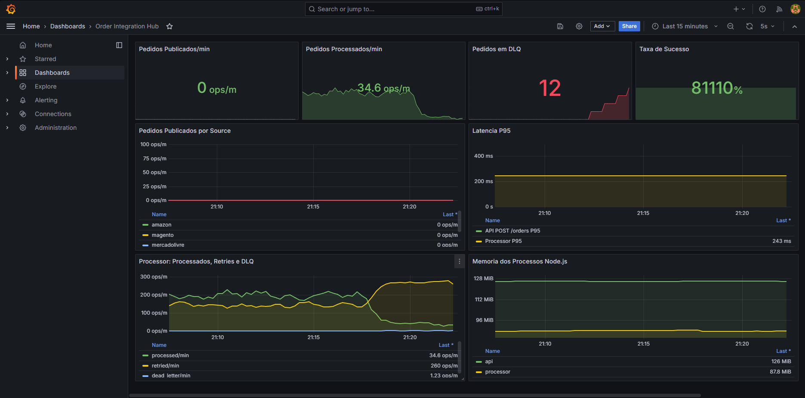
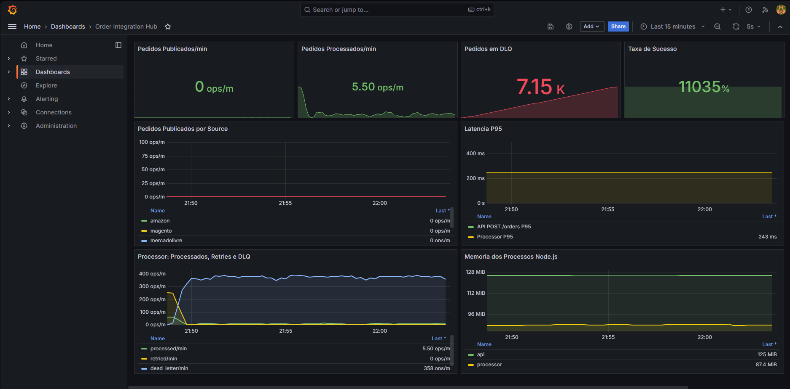
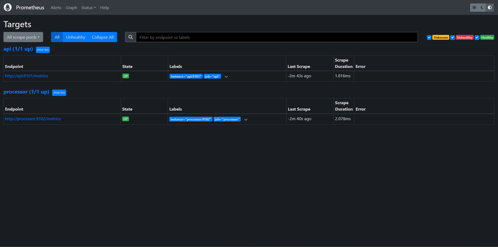
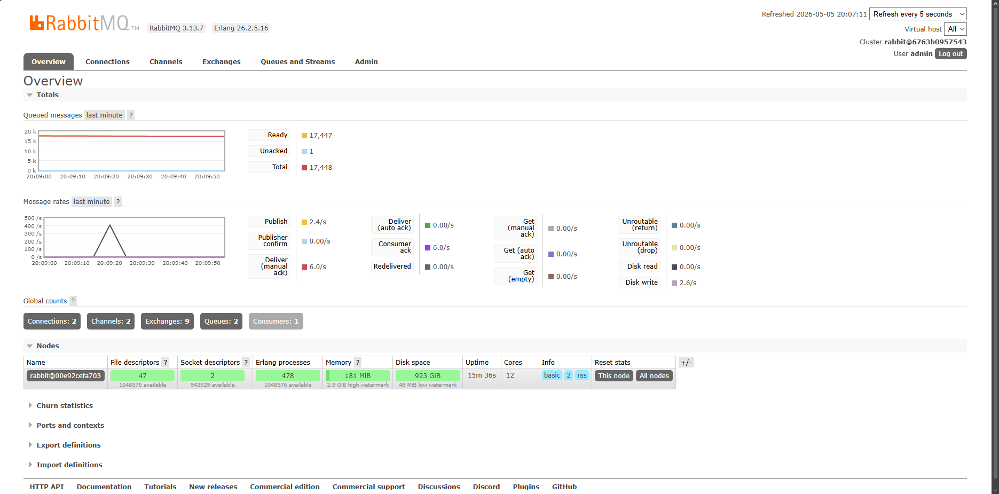

# Observabilidade

O projeto usa `prom-client` para expor métricas da API e do processor. O Prometheus coleta essas métricas e o Grafana provisiona automaticamente o dashboard **Order Integration Hub**.

## Endpoints de Métricas

| Serviço | Endpoint interno no Compose | Endpoint local |
|---|---|---|
| API | `api:9101/metrics` | `http://localhost:9101/metrics` |
| Processor | `processor:9102/metrics` | `http://localhost:9102/metrics` |

Configuração do Prometheus:

```yaml
global:
  scrape_interval: 15s

scrape_configs:
  - job_name: api
    static_configs:
      - targets: ['api:9101']

  - job_name: processor
    static_configs:
      - targets: ['processor:9102']
```

## Métricas Customizadas

### API

| Métrica | Tipo | Labels | Descrição |
|---|---|---|---|
| `orders_published_total` | Counter | `source` | Total de pedidos publicados no RabbitMQ |
| `http_request_duration_seconds` | Histogram | `method`, `route`, `status_code` | Duração das requisições HTTP |

### Processor

| Métrica | Tipo | Labels | Descrição |
|---|---|---|---|
| `orders_processed_total` | Counter | `source` | Pedidos processados com sucesso |
| `orders_retried_total` | Counter | `source` | Retries publicados |
| `orders_failed_total` | Counter | `reason` | Falhas definitivas ou payloads inválidos |
| `order_processing_duration_seconds` | Histogram | `status`, `source` | Tempo de processamento de cada mensagem |

Além das métricas customizadas, os dois serviços expõem métricas padrão do Node.js, como heap, memória residente, event loop lag, CPU e handles ativos.

## PromQL Útil

Pedidos publicados por minuto:

```promql
sum(rate(orders_published_total[5m])) * 60
```

Pedidos processados por minuto:

```promql
sum(rate(orders_processed_total[5m])) * 60
```

Retries por minuto:

```promql
sum(rate(orders_retried_total[5m])) * 60
```

Falhas definitivas por minuto:

```promql
sum(rate(orders_failed_total{reason="max_attempts_exceeded"}[5m])) * 60
```

Pedidos publicados por source:

```promql
sum by (source) (rate(orders_published_total[5m])) * 60
```

P95 de latência HTTP:

```promql
histogram_quantile(
  0.95,
  sum by (le, method, route) (rate(http_request_duration_seconds_bucket[5m]))
)
```

P95 de processamento:

```promql
histogram_quantile(
  0.95,
  sum by (le, status) (rate(order_processing_duration_seconds_bucket[5m]))
)
```

Memória residente por processo:

```promql
process_resident_memory_bytes
```

Event loop lag:

```promql
nodejs_eventloop_lag_seconds
```

## Prints

### Grafana

Dashboard com throughput, taxa de sucesso, latência P95, retries e memória dos processos:



Dashboard após execução de carga com retries:



Dashboard mostrando crescimento de DLQ:



Dashboard com volume alto de mensagens em dead letter:



### Prometheus

Targets `api` e `processor` em estado `UP`:



### RabbitMQ

RabbitMQ Management exibindo filas, conexões, taxas de mensagens e mensagens acumuladas:



## Como Validar

Suba a stack:

```powershell
docker compose up -d --build
```

Confirme os targets no Prometheus:

```text
http://localhost:9090/targets
```

Acesse o dashboard:

```text
http://localhost:3000
```

Login:

```text
admin / 123456789
```

Gere carga:

```powershell
node scripts/create-random-orders.js --count 200 --failure-rate 0.35 --concurrency 15
```

Acompanhe o processor:

```powershell
docker compose logs -f processor
```

## O Que Observar

- `orders_published_total`: se a API está recebendo e publicando pedidos.
- `orders_processed_total`: se o consumer está conseguindo processar.
- `orders_retried_total`: se há instabilidade no ERP simulado ou falha forçada no payload.
- `orders_failed_total`: se o limite de tentativas foi excedido.
- `http_request_duration_seconds`: impacto da carga sobre a API.
- `order_processing_duration_seconds`: tempo médio e P95 do worker.
- `process_resident_memory_bytes`: comportamento de memória dos serviços Node.js.
